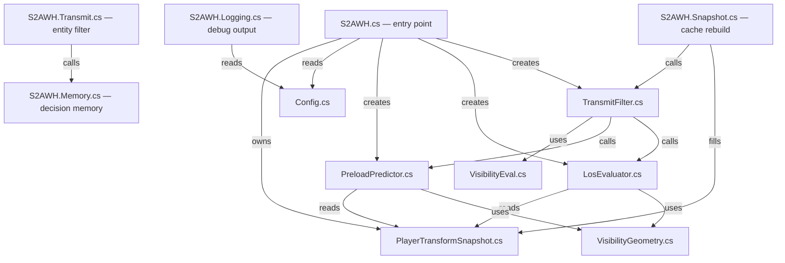

<div align="center">

# S2AWH

### Server-Side Anti-Wallhack for Counter-Strike 2

[](https://github.com/karola3vax/Source2-AntiWallHack/releases)
[](https://github.com/roflmuffin/CounterStrikeSharp/releases)
[](https://github.com/FUNPLAY-pro-CS2/Ray-Trace/releases)
[](./LICENSE)

*Wallhacks need data to work. S2AWH takes the data away.*

</div>

---

## The Problem

In CS2, your client normally receives the positions of **every** player on the map — even enemies behind walls. Wallhack cheats exploit this by rendering those hidden positions on screen.

## The Fix

S2AWH runs on your server and answers one question every tick:

> **Can this viewer actually see that enemy right now?**

- **Yes →** game works normally, data is sent.
- **No →** the server withholds the enemy data entirely. The cheat has nothing to display.

No client-side install. No player downloads. Just drop it on your server.

---

## ✨ Feature Highlights

| Feature | What It Does |
| :-- | :-- |
| 🎯 **4×4 LOS Surface Probes** | Samples 16 points across the target's body to detect visibility through narrow gaps, behind boxes, and around corners |
| 👁️ **FOV Culling** | Skips targets outside the viewer's cone early, saving CPU cycles |
| 🏃 **Predictive Preload** | Looks slightly ahead of moving players to prevent pop-in on peeks |
| 🦘 **Jump Assist** | Detects upcoming visibility during jumps and stair climbs before the player actually sees the enemy |
| 🔫 **Aim Proximity** | Catches near-crosshair edge cases that surface probes might miss |
| 🧩 **Entity Closure** | Hides not just the player model — but all attached weapons, wearables, equipment, particles, beams, and 18+ entity types together |
| 🔒 **Reverse Audit** | A final safety pass that blocks any hide that could leave a broken reference on the client |
| 🛡️ **Fail-Open Safety** | When in doubt, the plugin shows the player instead of risking a crash — stability over concealment |

---

## 🚀 Quick Start

### Requirements

| Dependency | Minimum Version |
| :-- | :-- |
| [CounterStrikeSharp](https://github.com/roflmuffin/CounterStrikeSharp/releases) | `v1.0.362+` |
| [MetaMod:Source](https://www.sourcemm.net/downloads.php?branch=dev) | `1387+` |
| [Ray-Trace](https://github.com/FUNPLAY-pro-CS2/Ray-Trace/releases) | `v1.0.4` |

### Install

1. Install CounterStrikeSharp, MetaMod, and Ray-Trace on your server.
2. Download the latest `S2AWH-x.x.x.zip` from [Releases](https://github.com/karola3vax/Source2-AntiWallHack/releases).
3. Extract it into your server's root directory.
4. Start the server and look for `[S2AWH]` in console.

That's it. S2AWH is active.

### File Locations

```
addons/counterstrikesharp/plugins/S2AWH/     ← plugin DLL + deps
addons/counterstrikesharp/configs/plugins/S2AWH/  ← config
```

> **Upgrading?** For the cleanest transition, delete your old `S2AWH.json` config before dropping in the new files.

---

## ⚙️ Configuration

S2AWH ships with sane defaults. Tune only what your server needs.

### Recommended Baselines

| Server Profile | `UpdateFrequencyTicks` | `RevealHoldSeconds` |
| :-- | :--: | :--: |
| 🏆 Competitive (5v5) | `2` | `0.30` |
| 🎮 Casual | `4` | `0.40` |
| 🌐 Large Server | `8` | `0.50` |
| 🏟️ High Population | `16` | `1.00` |

Lower `UpdateFrequencyTicks` = more precision, more CPU. Start conservative, then push lower only when the server has headroom.

### Key Settings

<details>
<summary><b>Core</b></summary>

| Key | Default | What It Does |
| :-- | :--: | :-- |
| `Core.Enabled` | `true` | Main on/off switch |
| `Core.UpdateFrequencyTicks` | `16` | How often visibility checks run |

</details>

<details>
<summary><b>Trace</b></summary>

| Key | Default | What It Does |
| :-- | :--: | :-- |
| `Trace.UseFovCulling` | `true` | Skip targets outside the viewer cone |
| `Trace.FovDegrees` | `240.0` | How wide the cone is |
| `Trace.AimRayHitRadius` | `100.0` | Tolerance for aim proximity checks |
| `Trace.AimRayCount` | `1` | Number of aim rays per viewer |
| `Trace.AimRayMaxDistance` | `3000.0` | Max range for aim rays |

</details>

<details>
<summary><b>Preload</b></summary>

| Key | Default | What It Does |
| :-- | :--: | :-- |
| `Preload.EnablePreload` | `true` | Master preload switch |
| `Preload.EnabledForPeekers` | `true` | Predict where the viewer is peeking |
| `Preload.EnabledForHolders` | `false` | Predict where the target is moving |
| `Preload.PredictorDistance` | `160.0` | How far ahead to look |
| `Preload.RevealHoldSeconds` | `0.10` | Keep a target visible briefly after LOS breaks |

</details>

<details>
<summary><b>Visibility</b></summary>

| Key | Default | What It Does |
| :-- | :--: | :-- |
| `Visibility.IncludeTeammates` | `false` | Apply logic to teammates |
| `Visibility.IncludeBots` | `true` | Include bots as targets |
| `Visibility.BotsDoLOS` | `true` | Let bots run LOS checks |

</details>

<details>
<summary><b>Diagnostics</b></summary>

| Key | Default | What It Does |
| :-- | :--: | :-- |
| `Diagnostics.ShowDebugInfo` | `true` | Periodic console health report |
| `Diagnostics.DrawDebugTraceBeams` | `false` | Visualize trace rays in-game |
| `Diagnostics.DrawDebugAabbBoxes` | `false` | Visualize AABB hitboxes in-game |
| `Diagnostics.DrawAmountOfRayNumber` | `false` | Per-viewer ray counter HUD |

</details>

---

## 📊 Monitoring

With `ShowDebugInfo` enabled, the console prints a status box every few seconds. The most important lines:

| Line | Healthy Pattern |
| :-- | :-- |
| `Owned cache` | Low `full resyncs`, higher `dirty updates` |
| `Closure offenders` | `none` is ideal |
| `Safety checks` | Low `fail-open` counts mean clean entity coverage |
| `Reveal hold` | Active `refreshed` / `kept alive` counts show anti-pop-in working |

---

## ❓ FAQ

**Does this run on the client?**
No. Server-side only.

**Do players need to install anything?**
No.

**Is this just glow blocking or cosmetic anti-ESP?**
No. It is visibility-driven transmit filtering at the server level. Hidden enemy data never reaches the client.

**Does it stop every cheat?**
Its purpose is to cut off hidden enemy information. It does not address aimbots, trigger bots, or other exploits.

**Can it affect performance?**
Yes — this is real-time ray tracing on every tick. Tune `UpdateFrequencyTicks` to match your server's capacity.

**Why does the plugin sometimes show players it shouldn't?**
Because sending more data is safer than sending a broken partial set that could crash clients. This is the **fail-open** design — stability always wins.

**Do I need `S2AWH.deps.json`?**
Yes. Always ship it alongside the DLL.

---

### Source Dependency Graph



---

## Credits

- **[karola3vax](https://github.com/karola3vax)** — Author
- **[CounterStrikeSharp](https://github.com/roflmuffin/CounterStrikeSharp)** by [roflmuffin](https://github.com/roflmuffin)
- **[Ray-Trace](https://github.com/FUNPLAY-pro-CS2/Ray-Trace)** by [SlynxCZ](https://github.com/SlynxCZ)
- **[MetaMod:Source](https://www.metamodsource.net/)** by [AlliedModders](https://github.com/alliedmodders)

## License

MIT — see [LICENSE](./LICENSE)

<div align="center">
<br>
<i>S2AWH keeps hidden information where it belongs: on the server.</i>
<br><br>
</div>
