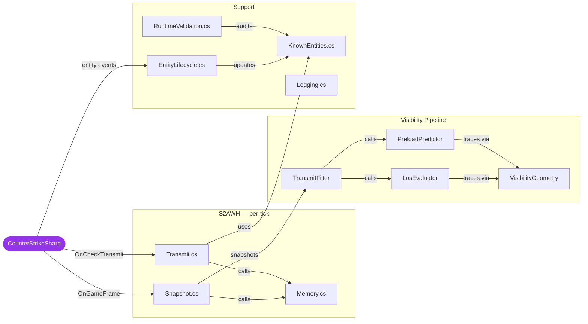

<div align="center">

<br>

# S2AWH

**Source 2 Anti-Wallhack** &nbsp;·&nbsp; Server-side ESP prevention for Counter-Strike 2

<br>

[](https://github.com/karola3vax/Source2-AntiWallHack/releases)
&nbsp;
[](https://github.com/roflmuffin/CounterStrikeSharp/releases)
&nbsp;
[](https://github.com/FUNPLAY-pro-CS2/Ray-Trace/releases)
&nbsp;
[](./LICENSE)

<br>

> *Wallhacks need data to work. S2AWH takes the data away.*

<br>

</div>

---

## What Is This?

In CS2, every client receives the world state of **all** players — including enemies hidden behind solid walls. Wallhack cheats exploit this by rendering those hidden positions on screen.

S2AWH intercepts the server's network transmit step each tick and answers one question per viewer/target pair:

<br>

<div align="center">

**Can this player actually see that enemy right now?**

| Answer | Result |
| :---: | :---: |
| **Yes** | Data is transmitted. Game works normally. |
| **No** | Data is withheld entirely. The cheat has nothing to render. |

</div>

<br>

No client-side install. No VAC interaction. No player downloads. Drop it on your server and it works.

---

## How Visibility Is Decided

Every visibility evaluation passes through a layered pipeline. Each stage short-circuits upward on a **Visible** result — the first path that confirms visibility wins:

```text
┌─────────────────────────────────────────────────────────────┐
│                    CheckTransmit Tick                        │
└──────────────────────────┬──────────────────────────────────┘
                           │  for each viewer → target pair
                           ▼
              ┌────────────────────────┐
              │  1. FOV Gate           │  Outside 240° cone? → Hidden
              └────────────┬───────────┘
                           │ inside cone
                           ▼
              ┌────────────────────────┐
              │  2. 4×4 AABB Probes    │  16 rays to nearest body face
              │     MASK_WORLD_ONLY    │  (world geometry only, no hitboxes)
              └────────────┬───────────┘
                           │ all blocked
                           ▼
              ┌────────────────────────┐
              │  3. Aim-Ray Proximity  │  Up to 5 rays near crosshair
              └────────────┬───────────┘
                           │ miss
                           ▼
              ┌────────────────────────┐
              │  4. Jump Peek Assist   │  Upcoming visibility during jumps
              └────────────┬───────────┘
                           │ not predicted
                           ▼
              ┌────────────────────────┐
              │  5. Predictive Preload │  Velocity-extrapolated future AABB
              └────────────┬───────────┘
                           │ no future visibility
                           ▼
              ┌────────────────────────┐
              │     Decision: HIDDEN   │
              └────────────┬───────────┘
                           │
                           ▼
              ┌─────────────────────────────────────────────┐
              │         Memory Layer (anti-flicker)          │
              │                                              │
              │  RevealHold    → still within hold window?  │
              │  StableDecision→ last known result cached?  │
              │  VisibleConfirm→ 4-tick reacquire debounce  │
              └─────────────────────────────────────────────┘
```

> Every error path — null pawn, invalid handle, trace fault, engine state — returns **Visible** (fail-open). The plugin will never hide a player due to an internal failure.

---

## Features

<table>
<tr>
<td width="50%" valign="top">

### 🎯 &nbsp;4×4 AABB Surface Probes

Fires **16 rays** across a 4×4 grid on the face of the target's bounding box nearest to the viewer. Catches visibility through narrow gaps, at wall edges, and around partial cover that single-ray checks miss entirely.

The probe face is selected by geometric proximity and validated with a dual-face ratio check — if the secondary face has significantly more valid probes, it switches automatically.

</td>
<td width="50%" valign="top">

### 👁️ &nbsp;FOV Culling

Pre-filters targets outside the viewer's forward cone before any ray is fired. Uses a conservative sphere-vs-cone check against the target's bounding sphere, then validates 8 AABB corners and 6 lateral face centers.

False positives (not culling when you could) are acceptable. False negatives (culling a visible player) are not — so the geometry is intentionally over-inclusive.

</td>
</tr>
<tr>
<td width="50%" valign="top">

### 🏃 &nbsp;Predictive Preload

Extrapolates each player's position forward along their current velocity. The future AABB scales dynamically with movement speed (adaptive profile) and shifts directionally in the movement heading.

Separate controls for **peekers** (viewer moving toward angle) and **holders** (target moving into view) with independent distance factors.

</td>
<td width="50%" valign="top">

### 🦘 &nbsp;Jump Peek Assist

Detects upcoming visibility during jump arcs and stair climbs before the player fully clears the obstacle. Prevents the pop-in that happens when a jumping player suddenly becomes visible mid-air with no warning.

Runs independently from preload configuration — it is always on.

</td>
</tr>
<tr>
<td width="50%" valign="top">

### 🔫 &nbsp;Aim-Ray Proximity

After surface probes fail, fires up to **5 additional rays** near the viewer's crosshair aim direction. Catches edge cases where the target is technically AABB-occluded but the viewer's eye line reaches the target directly.

Configurable radius, spread, count, and maximum range.

</td>
<td width="50%" valign="top">

### 🧩 &nbsp;Full Entity Closure

Hiding a player hides **everything** attached to them at once. The closure graph captures:

- Pawn · controller
- Active, last, saved, and inventory weapons
- Wearables and bone-attached cosmetics
- Scene descendants (up to 256 nodes, 10 levels deep)
- 18+ designer-typed entity relations: beams, particles, ropes, grenades, flames, pings, dogtags, planted C4, hostages, breakables, and more

</td>
</tr>
<tr>
<td width="50%" valign="top">

### 🔒 &nbsp;Reverse Transmit Audit

Before any hide is committed, a final pass checks whether any other currently-visible player holds a cross-reference to the target entity. If a broken reference is detected, the target stays visible rather than risk a client crash.

</td>
<td width="50%" valign="top">

### 🛡️ &nbsp;Three-Layer Anti-Flicker Memory

**RevealHold** — keeps a target visible for a configurable window after LOS breaks (prevents pop-out at geometry edges).

**StableDecision** — caches the last known result and reuses it during transient unknown evaluations (absorbs trace gaps).

**VisibleConfirm** — requires 4 consecutive ticks (~62 ms) of confirmed visibility before a previously-hidden player reappears (prevents pop-in).

</td>
</tr>
</table>

---

## Installation

### Requirements

| | Dependency | Minimum |
| :---: | :-- | :--: |
| **[1]** | [CounterStrikeSharp](https://github.com/roflmuffin/CounterStrikeSharp/releases) | `v1.0.362+` |
| **[2]** | [MetaMod:Source](https://www.sourcemm.net/downloads.php?branch=dev) | `1387+` |
| **[3]** | [Ray-Trace](https://github.com/FUNPLAY-pro-CS2/Ray-Trace/releases) | `v1.0.6+` |

> The Ray-Trace Metamod module and `RayTraceApi.dll` must be on the **same release line**. Mismatched versions silently break LOS tracing.

<br>

### Steps

```text
1.  Install MetaMod:Source, CounterStrikeSharp, and Ray-Trace.
2.  Download the latest S2AWH-x.x.x.zip from Releases.
3.  Extract into your server root — no path changes needed.
4.  Start the server. Look for [S2AWH] in console output.
```

<br>

### File Layout

```text
game/csgo/
└── addons/
    └── counterstrikesharp/
        ├── plugins/
        │   └── S2AWH/
        │       ├── S2AWH.dll          ← plugin
        │       ├── S2AWH.deps.json    ← required — always ship this
        │       └── RayTraceApi.dll    ← Ray-Trace managed bridge
        └── configs/
            └── plugins/
                └── S2AWH/
                    └── S2AWH.json     ← auto-generated on first run
```

> **Upgrading?** Delete `S2AWH.json` before updating. Legacy config keys are migrated automatically where possible.

<br>

### Trace Scope

S2AWH tests visibility against **world geometry only**: solid brushes, glass, and bullet-passthrough surfaces (`MASK_WORLD_ONLY = 0x3001`).

Smoke grenades, fire, and other gameplay occluders are intentionally excluded. Keeping the trace mask stable and narrow prevents the server-side decision from oscillating on transient geometry that would cause constant pop-in/pop-out.

---

## Configuration

S2AWH ships with conservative defaults. On most servers only two values need tuning:

<br>

### Baseline Presets

| Profile | `Core.UpdateFrequencyTicks` | `Preload.RevealHoldSeconds` | Notes |
| :-- | :---: | :---: | :-- |
| 🏆 Competitive 5v5 | `2` | `0.10` | Highest precision, most CPU |
| 🎮 Casual / Public | `4–8` | `0.20` | Good balance |
| 🌐 Large Server 16–32 | `8` | `0.30` | Safe starting point |
| 🏟️ High Population 32+ | `16` | `0.50` | Conservative — tune down from here |

`UpdateFrequencyTicks` controls how many server ticks pass between full visibility rebuilds. Lower = more accurate, proportionally higher CPU cost.

<br>

### Full Reference

<details>
<summary><b>Core</b> — fundamental operation</summary>

<br>

| Key | Default | Range | Description |
| :-- | :---: | :---: | :-- |
| `Core.Enabled` | `true` | — | Master on/off switch |
| `Core.UpdateFrequencyTicks` | `4` | `1–512` | Ticks between full visibility rebuilds |

</details>

<details>
<summary><b>Trace</b> — LOS ray settings</summary>

<br>

| Key | Default | Range | Description |
| :-- | :---: | :---: | :-- |
| `Trace.UseFovCulling` | `true` | — | Skip targets outside the viewer's forward cone before tracing |
| `Trace.FovDegrees` | `240.0` | `1–359` | Total cone width — 240° means targets within 120° of forward are never FOV-culled |
| `Trace.AimRayCount` | `1` | `1–5` | Aim rays fired per viewer per target after surface probes fail |
| `Trace.AimRayHitRadius` | `100.0` | `0–500` | Proximity tolerance for aim-ray hits (units) |
| `Trace.AimRaySpreadDegrees` | `1.0` | `0–5` | Angular spread between aim rays |
| `Trace.AimRayMaxDistance` | `3000.0` | `0–8192` | Maximum range for aim-ray checks (units) |

</details>

<details>
<summary><b>Preload</b> — predictive visibility and anti-flicker</summary>

<br>

| Key | Default | Range | Description |
| :-- | :---: | :---: | :-- |
| `Preload.EnablePreload` | `true` | — | Master switch for predictive preload |
| `Preload.EnabledForPeekers` | `true` | — | Predict ahead for viewers moving toward an angle |
| `Preload.EnabledForHolders` | `false` | — | Predict ahead for targets who are moving |
| `Preload.PredictorDistance` | `160.0` | `0–∞` | Look-ahead distance along player velocity (units) |
| `Preload.PredictorMinSpeed` | `60.0` | `0–100` | Speed below which prediction is not applied |
| `Preload.PredictorFullSpeed` | `120.0` | `>MinSpeed` | Speed at which full predictor distance is used |
| `Preload.ViewerPredictorDistanceFactor` | `1.0` | `0–2` | Scales look-ahead distance for the viewer specifically |
| `Preload.SurfaceProbeHitRadius` | `80.0` | `0–200` | Hit tolerance for preload surface probes (units) |
| `Preload.RevealHoldSeconds` | `0.10` | `0–1` | Keep target visible this long after LOS breaks (anti-pop-out) |

</details>

<details>
<summary><b>Aabb</b> — bounding box scaling and directional shift</summary>

<br>

The AABB section controls how the plugin sizes and positions the bounding box used for LOS probing and prediction. The LOS box is intentionally shrunk (default `0.5×` horizontal) so probes sample the inner body volume rather than the edge of the hitbox — this reduces false positives from thin walls tangent to the AABB edge.

| Key | Default | Range | Description |
| :-- | :---: | :---: | :-- |
| `Aabb.LosHorizontalScale` | `0.5` | `0.1–10` | Horizontal AABB scale for LOS surface probes |
| `Aabb.LosVerticalScale` | `0.7` | `0.1–10` | Vertical AABB scale for LOS surface probes |
| `Aabb.LosSurfaceProbeHitRadius` | `80.0` | `0–200` | Hit tolerance for LOS surface probes (units) |
| `Aabb.PredictorHorizontalScale` | `1.0` | `1–10` | Horizontal scale for the predictor (future) AABB |
| `Aabb.PredictorVerticalScale` | `1.0` | `1–10` | Vertical scale for the predictor AABB |
| `Aabb.PredictorScaleStartSpeed` | `60.0` | `0–∞` | Speed below which predictor AABB does not grow |
| `Aabb.PredictorScaleFullSpeed` | `120.0` | `>StartSpeed` | Speed at which predictor AABB reaches maximum size |
| `Aabb.EnableAdaptiveProfile` | `true` | — | Dynamically expand probe AABB as target moves faster |
| `Aabb.ProfileSpeedStart` | `60.0` | `0–∞` | Speed at which adaptive expansion begins |
| `Aabb.ProfileSpeedFull` | `120.0` | `>SpeedStart` | Speed at which adaptive expansion reaches its cap |
| `Aabb.ProfileHorizontalMaxMultiplier` | `1.70` | `1–3` | Maximum horizontal expansion under adaptive profile |
| `Aabb.ProfileVerticalMaxMultiplier` | `1.35` | `1–3` | Maximum vertical expansion under adaptive profile |
| `Aabb.EnableDirectionalShift` | `true` | — | Shift probe AABB forward along target's movement direction |
| `Aabb.DirectionalForwardShiftMaxUnits` | `34.0` | `0–128` | Maximum forward shift (units) |
| `Aabb.DirectionalPredictorShiftFactor` | `0.65` | `0–2` | How much predictor velocity contributes to the shift |

</details>

<details>
<summary><b>Visibility</b> — who gets checked</summary>

<br>

| Key | Default | Description |
| :-- | :---: | :-- |
| `Visibility.IncludeTeammates` | `false` | Apply LOS filtering to teammates as well |
| `Visibility.IncludeBots` | `true` | Include bots as valid targets |
| `Visibility.BotsDoLOS` | `true` | Allow bots to act as viewers |

</details>

<details>
<summary><b>Diagnostics</b> — observability and debugging</summary>

<br>

| Key | Default | Description |
| :-- | :---: | :-- |
| `Diagnostics.ShowDebugInfo` | `true` | Periodic console health-report box every ~64 seconds |
| `Diagnostics.DrawDebugTraceBeams` | `false` | Render LOS/preload/aim trace rays as in-game beams |
| `Diagnostics.DrawDebugTraceBeamsForHumans` | `true` | Include human viewers in beam drawing |
| `Diagnostics.DrawDebugTraceBeamsForBots` | `true` | Include bot viewers in beam drawing |
| `Diagnostics.DrawDebugAabbBoxes` | `false` | Render probe and predictor AABBs in-game |
| `Diagnostics.DrawOnlyPurpleAabb` | `false` | When drawing AABBs, show only the predictor (purple) box |
| `Diagnostics.DrawAmountOfRayNumber` | `false` | Show per-viewer ray count in the center HUD |

> ⚠️ `DrawDebugTraceBeams` and `DrawDebugAabbBoxes` spawn `env_beam` entities every tick. Use on test servers only.

</details>

---

## Monitoring

With `Diagnostics.ShowDebugInfo: true`, a structured report prints to console approximately every 64 seconds. The most useful signals:

<br>

<table>
<tr>
<th>Section</th>
<th>Field</th>
<th>Healthy</th>
<th>Action if Not</th>
</tr>
<tr>
<td><b>Transmit</b></td>
<td><code>fail-open</code></td>
<td>At or near <code>0</code></td>
<td>Traces returning ambiguous results — check Ray-Trace plugin status</td>
</tr>
<tr>
<td><b>Transmit</b></td>
<td><code>hidden</code></td>
<td>Non-zero during active play</td>
<td>If always <code>0</code> mid-round, LOS checks may be short-circuiting</td>
</tr>
<tr>
<td><b>Owned cache</b></td>
<td><code>dirty updates</code></td>
<td>Higher than <code>full resyncs</code></td>
<td>If equal, incremental tracking may be broken — check entity lifecycle hooks</td>
</tr>
<tr>
<td><b>Owned cache</b></td>
<td><code>full resyncs</code></td>
<td>Low; spikes on connect/disconnect only</td>
<td>Constant high value → excessive entity churn</td>
</tr>
<tr>
<td><b>Owned cache</b></td>
<td><code>pending rescans</code></td>
<td>Drains to <code>0</code> within a few seconds of player spawn</td>
<td>If stuck, entity lifecycle events may be misfiring</td>
</tr>
<tr>
<td><b>Closure offenders</b></td>
<td>any entry</td>
<td><code>none</code></td>
<td>An entity type is evading the closure graph — can cause "ghost weapon" artifacts</td>
</tr>
<tr>
<td><b>Reveal hold</b></td>
<td><code>refreshed</code> / <code>kept alive</code></td>
<td>Non-zero during active play</td>
<td>Zero means <code>RevealHoldSeconds</code> is too low or preload is disabled</td>
</tr>
<tr>
<td><b>Unknown evals</b></td>
<td><code>sticky hit</code> ratio</td>
<td>High relative to <code>fail-open</code></td>
<td>Low ratio → stable-decision cache is expiring too quickly</td>
</tr>
</table>

---

## FAQ

<details>
<summary>Does this run on the client?</summary>

No. Server-side only. Players install nothing.

</details>

<details>
<summary>Is this just glow blocking or cosmetic anti-ESP?</summary>

No. It is transmit filtering at the network layer. A hidden enemy's position data **never reaches the client** — it is withheld before the packet is sent. There is nothing for a cheat to render.

</details>

<details>
<summary>Does it stop every cheat?</summary>

Its purpose is to cut off **hidden enemy information**. It does not address aimbots, trigger bots, bunny hop tools, or any exploit that does not depend on receiving off-screen player positions.

</details>

<details>
<summary>Can it affect server performance?</summary>

Yes. S2AWH fires real ray traces against world geometry each tick. The `Core.UpdateFrequencyTicks` setting controls the cost. The default is `4` (good balance of accuracy and CPU); push higher only on 32+ player servers with tight headroom.

On a 10-player server at `UpdateFrequencyTicks = 4`, the practical per-tick ray count stays in the low dozens due to FOV culling and stationary-pair caching.

</details>

<details>
<summary>Why does the plugin sometimes show players it shouldn't?</summary>

This is the **fail-open** design. Transmitting extra data is always safer than transmitting a broken partial entity set that would crash the client. When in doubt, the plugin errs toward showing the player.

</details>

<details>
<summary>A player briefly appeared and vanished — is that a bug?</summary>

No. The reacquire debounce requires approximately 62 ms (~4 ticks at 64 Hz) of unbroken LOS before a previously-hidden player is shown again. This prevents flicker at geometry edges where the result alternates tick-by-tick.

</details>

<details>
<summary>Do I need S2AWH.deps.json?</summary>

Yes. Always ship it alongside the DLL. The .NET runtime uses it to resolve managed dependencies.

</details>

<details>
<summary>A config key stopped working after an update.</summary>

Legacy aliases `Preload.EnableProbePreload`, `Preload.EnableSurfacePreload`, and `Preload.EnableViewerPeekAssist` are still read and mapped automatically. Check console output on startup for migration warnings.

</details>

---

## Architecture

### Source Modules

```text
S2AWH/src/
├── S2AWH.cs                      Plugin entry, field declarations, HUD overlay, tick loop
├── S2AWH.Snapshot.cs             PlayerTransformSnapshot rebuild, staggered viewer eval
├── S2AWH.Transmit.cs             CheckTransmit callback, entity closure, bitvec operations
├── S2AWH.Transmit.KnownEntities.cs  Handle tracking, bootstrap, validity checks
├── S2AWH.Memory.cs               RevealHold · StableDecision · VisibleConfirm
├── S2AWH.EntityLifecycle.cs      Connect/disconnect, entity created/deleted/spawned hooks
├── S2AWH.RuntimeValidation.cs    Self-repair, CSS version gate, TraceResult introspection
├── S2AWH.Logging.cs              Structured debug summary, box drawing, log formatting
├── TransmitFilter.cs             FOV gating, pipeline orchestration, IsFov geometry
├── LosEvaluator.cs               4×4 AABB surface probes, aim-ray proximity fallback
├── PreloadPredictor.cs           Velocity extrapolation, jump assist prediction
├── VisibilityGeometry.cs         Trace helpers, debug beam/AABB drawing
├── PlayerTransformSnapshot.cs    Zero-allocation struct — all spatial state per player per tick
├── VisibilityEval.cs             VisibilityEval enum (Hidden/Visible/UnknownTransient) · VisibilityDecision
├── Config.cs                     S2AWHConfig, Normalize(), ClampWithWarning, FOV precompute
└── S2AWHConstants.cs             VisibilitySlotCapacity = 65
```

<br>

### Call Flow



<br>

### Entity Closure Graph

When a player is marked hidden, S2AWH builds a **closure** — the complete set of entities that must be hidden together to avoid broken client references. The closure is maintained incrementally through entity lifecycle events and refreshed in full on a background schedule.

```text
Player Pawn
 ├─ Weapon: active slot
 ├─ Weapon: last slot
 ├─ Weapon: saved slot
 ├─ Weapon: inventory
 ├─ Wearables (cosmetics, bone-attached gear)
 └─ CGameSceneNode hierarchy (max 256 nodes, depth 10)
     └─ Designer-typed relations
         ├─ env_beam, env_sprite, env_particle_system
         ├─ point_worldtext, rope entities
         ├─ Grenades and projectiles
         ├─ Flames, trigger volumes, ambient_generic
         ├─ Chickens, player pings, physbox
         ├─ Dogtags, planted C4, hostages
         └─ Breakables, instructor hint entities
```

Before any hide is committed, the **reverse transmit audit** scans all entities in the closure against the full list of currently-visible targets. If any entity in the closure is referenced by a different visible player, the hide is aborted and the target stays visible.

---

## Dependencies

| Library | Role |
| :-- | :-- |
| [CounterStrikeSharp](https://github.com/roflmuffin/CounterStrikeSharp) | Plugin framework — entity access, event hooks, managed interop with CS2 |
| [Ray-Trace](https://github.com/FUNPLAY-pro-CS2/Ray-Trace) | Native C++ world-geometry ray tracing via hooked `CNavPhysicsInterface::TraceShape` |
| [MetaMod:Source](https://www.metamodsource.net/) | Plugin loader and native interface discovery |

---

## Credits

**[karola3vax](https://github.com/karola3vax)** — Author

[CounterStrikeSharp](https://github.com/roflmuffin/CounterStrikeSharp) by [roflmuffin](https://github.com/roflmuffin) &nbsp;·&nbsp;
[Ray-Trace](https://github.com/FUNPLAY-pro-CS2/Ray-Trace) by [SlynxCZ](https://github.com/SlynxCZ) &nbsp;·&nbsp;
[MetaMod:Source](https://www.metamodsource.net/) by [AlliedModders](https://github.com/alliedmodders)

## License

MIT — see [LICENSE](./LICENSE)

<div align="center">
<br>
<sub>S2AWH keeps hidden information where it belongs — on the server.</sub>
<br><br>
</div>
