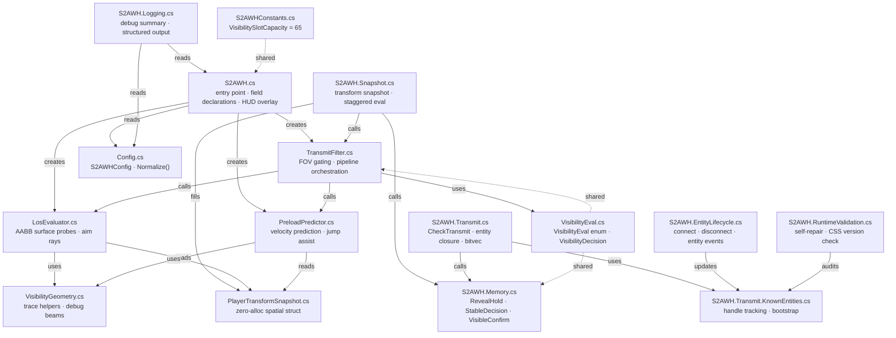

<div align="center">

# S2AWH

### Server-Side Anti-Wallhack for Counter-Strike 2

[](https://github.com/karola3vax/Source2-AntiWallHack/releases)
[](https://github.com/roflmuffin/CounterStrikeSharp/releases)
[](https://github.com/FUNPLAY-pro-CS2/Ray-Trace/releases)
[](./LICENSE)

*Wallhacks need data to work. S2AWH takes the data away.*

</div>

---

## The Problem

In CS2, your client normally receives the positions of **every** player on the map — even enemies behind walls. Wallhack cheats exploit this by rendering those hidden positions on screen.

## The Fix

S2AWH runs on your server and answers one question every tick:

> **Can this viewer actually see that enemy right now?**

- **Yes →** game works normally, data is sent.
- **No →** the server withholds the enemy data entirely. The cheat has nothing to display.

No client-side install. No player downloads. Just drop it on your server.

---

## ✨ Feature Highlights

| Feature | What It Does |
| :-- | :-- |
| 🎯 **4×4 LOS Surface Probes** | Fires 16 rays across the nearest face of the target's bounding box — catches visibility through narrow gaps, around corners, and behind partial cover |
| 👁️ **FOV Culling** | Skips targets outside the viewer's forward cone before tracing begins, saving CPU on crowded servers |
| 🏃 **Predictive Preload** | Extrapolates moving player positions one step ahead to prevent pop-in on peeks |
| 🦘 **Jump Assist** | Detects upcoming visibility during jumps and stair climbs before the player fully clears the obstacle |
| 🔫 **Aim Proximity** | Fires up to 5 additional aim rays near the crosshair to catch edge cases that surface probes miss |
| 🧩 **Full Entity Closure** | Hides not just the player model — weapons, wearables, particles, beams, ropes, grenades, flames, pings, dogtags, planted C4, hostages, breakables, and 18+ other entity types are hidden together |
| 🔒 **Reverse Transmit Audit** | A final safety pass that blocks any hide which would leave a broken cross-reference on the client |
| 🛡️ **Fail-Open Safety** | Every error path transmits rather than hides — stability always wins over concealment |

---

## 🚀 Quick Start

### Requirements

| Dependency | Minimum Version |
| :-- | :-- |
| [CounterStrikeSharp](https://github.com/roflmuffin/CounterStrikeSharp/releases) | `v1.0.362+` |
| [MetaMod:Source](https://www.sourcemm.net/downloads.php?branch=dev) | `1387+` |
| [Ray-Trace](https://github.com/FUNPLAY-pro-CS2/Ray-Trace/releases) | `v1.0.6+` |

### Install

1. Install CounterStrikeSharp, MetaMod, and Ray-Trace on your server.
2. Keep the Ray-Trace Metamod module and `RayTraceApi.dll` on the same `v1.0.6+` release — mismatched versions will break LOS tracing.
3. Download the latest `S2AWH-x.x.x.zip` from [Releases](https://github.com/karola3vax/Source2-AntiWallHack/releases).
4. Extract into your server's root directory.
5. Start the server and look for `[S2AWH]` in console.

That's it. S2AWH is active.

### File Locations

```
addons/counterstrikesharp/plugins/S2AWH/          ← S2AWH.dll, S2AWH.deps.json, RayTraceApi.dll
addons/counterstrikesharp/configs/plugins/S2AWH/  ← S2AWH.json (auto-generated on first run)
```

> **Upgrading?** Delete your old `S2AWH.json` before dropping in the new files for the cleanest transition. Old config keys are automatically migrated where possible.

### What S2AWH Traces

S2AWH tests visibility against **world geometry only** — solid brushes, glass, and bullet-passthrough surfaces. Smoke, fire, and other gameplay occluders are intentionally outside the trace mask. This keeps the server-side decision stable and consistently fail-open under trace faults.

---

## ⚙️ Configuration

S2AWH ships with sane defaults. Most servers need to tune only `UpdateFrequencyTicks` and `RevealHoldSeconds`.

### Recommended Baselines

| Server Profile | `Core.UpdateFrequencyTicks` | `Preload.RevealHoldSeconds` |
| :-- | :--: | :--: |
| 🏆 Competitive (5v5) | `2` | `0.10` |
| 🎮 Casual | `4` | `0.20` |
| 🌐 Large Server (16–32) | `8` | `0.30` |
| 🏟️ High Population (32+) | `16` | `0.50` |

Lower `UpdateFrequencyTicks` → more precision, more CPU. Start conservative, then push lower only when the server has headroom.

---

### Key Settings

<details>
<summary><b>Core</b></summary>

| Key | Default | Range | What It Does |
| :-- | :--: | :--: | :-- |
| `Core.Enabled` | `true` | — | Main on/off switch |
| `Core.UpdateFrequencyTicks` | `16` | `1–512` | Ticks between full visibility rebuilds. Lower = more accurate, higher CPU cost |

</details>

<details>
<summary><b>Trace</b></summary>

| Key | Default | Range | What It Does |
| :-- | :--: | :--: | :-- |
| `Trace.UseFovCulling` | `true` | — | Skip targets outside the viewer's forward cone before tracing |
| `Trace.FovDegrees` | `240.0` | `1–359` | Total cone width. 240° means targets within 120° of forward are never FOV-culled |
| `Trace.AimRayHitRadius` | `100.0` | `0–500` | Proximity tolerance for aim-ray hits (units) |
| `Trace.AimRaySpreadDegrees` | `1.0` | `0–5` | Angular spread between aim rays |
| `Trace.AimRayCount` | `1` | `1–5` | Number of aim rays fired per viewer per target |
| `Trace.AimRayMaxDistance` | `3000.0` | `0–8192` | Maximum range for aim-ray checks (units) |

</details>

<details>
<summary><b>Preload</b></summary>

| Key | Default | Range | What It Does |
| :-- | :--: | :--: | :-- |
| `Preload.EnablePreload` | `true` | — | Master switch for predictive preload |
| `Preload.EnabledForPeekers` | `true` | — | Predict ahead for viewers who are moving toward an angle |
| `Preload.EnabledForHolders` | `false` | — | Predict ahead for targets who are moving |
| `Preload.PredictorDistance` | `160.0` | `0–∞` | How far (units) to look ahead along the player's velocity |
| `Preload.PredictorMinSpeed` | `60.0` | `0–100` | Speed below which prediction is not applied |
| `Preload.PredictorFullSpeed` | `120.0` | `> MinSpeed` | Speed at which full predictor distance is used |
| `Preload.ViewerPredictorDistanceFactor` | `1.0` | `0–2` | Scales the look-ahead distance for the viewer side specifically |
| `Preload.SurfaceProbeHitRadius` | `80.0` | `0–200` | Hit tolerance for preload surface probes (units) |
| `Preload.RevealHoldSeconds` | `0.10` | `0–1` | Keep a target visible for this long after LOS breaks, preventing pop-out flicker |

</details>

<details>
<summary><b>Aabb</b></summary>

Controls how the plugin scales and positions the bounding box used for LOS probing and prediction.

| Key | Default | Range | What It Does |
| :-- | :--: | :--: | :-- |
| `Aabb.LosHorizontalScale` | `0.5` | `0.1–10` | Horizontal AABB scale for LOS surface probes. `0.5` = half width |
| `Aabb.LosVerticalScale` | `0.7` | `0.1–10` | Vertical AABB scale for LOS surface probes |
| `Aabb.LosSurfaceProbeHitRadius` | `80.0` | `0–200` | Hit tolerance for LOS surface probes (units) |
| `Aabb.PredictorHorizontalScale` | `1.0` | `1–10` | Horizontal AABB scale for the predictor AABB (purple box in debug) |
| `Aabb.PredictorVerticalScale` | `1.0` | `1–10` | Vertical AABB scale for the predictor AABB |
| `Aabb.PredictorScaleStartSpeed` | `60.0` | `0–∞` | Speed below which the predictor AABB does not grow |
| `Aabb.PredictorScaleFullSpeed` | `120.0` | `> StartSpeed` | Speed at which the predictor AABB reaches its maximum size |
| `Aabb.EnableAdaptiveProfile` | `true` | — | Dynamically expands the probe AABB as the target moves faster |
| `Aabb.ProfileSpeedStart` | `60.0` | `0–∞` | Speed at which adaptive profile begins expanding the AABB |
| `Aabb.ProfileSpeedFull` | `120.0` | `> SpeedStart` | Speed at which the adaptive profile reaches its multiplier cap |
| `Aabb.ProfileHorizontalMaxMultiplier` | `1.70` | `1–3` | Maximum horizontal AABB growth factor under adaptive profile |
| `Aabb.ProfileVerticalMaxMultiplier` | `1.35` | `1–3` | Maximum vertical AABB growth factor under adaptive profile |
| `Aabb.EnableDirectionalShift` | `true` | — | Shifts the probe AABB forward along the target's movement direction |
| `Aabb.DirectionalForwardShiftMaxUnits` | `34.0` | `0–128` | Maximum forward shift distance (units) |
| `Aabb.DirectionalPredictorShiftFactor` | `0.65` | `0–2` | How much predictor velocity contributes to the directional shift |

</details>

<details>
<summary><b>Visibility</b></summary>

| Key | Default | Range | What It Does |
| :-- | :--: | :--: | :-- |
| `Visibility.IncludeTeammates` | `false` | — | Apply LOS filtering to teammates as well |
| `Visibility.IncludeBots` | `true` | — | Include bots as valid targets |
| `Visibility.BotsDoLOS` | `true` | — | Allow bots to act as viewers and perform LOS checks |

</details>

<details>
<summary><b>Diagnostics</b></summary>

| Key | Default | What It Does |
| :-- | :--: | :-- |
| `Diagnostics.ShowDebugInfo` | `true` | Periodic console health-report box every ~64 seconds |
| `Diagnostics.DrawDebugTraceBeams` | `false` | Render LOS/preload/aim trace rays as in-game beams |
| `Diagnostics.DrawDebugTraceBeamsForHumans` | `true` | Include human viewers when drawing trace beams |
| `Diagnostics.DrawDebugTraceBeamsForBots` | `true` | Include bot viewers when drawing trace beams |
| `Diagnostics.DrawDebugAabbBoxes` | `false` | Render the LOS probe AABB and predictor AABB in-game |
| `Diagnostics.DrawOnlyPurpleAabb` | `false` | When drawing AABBs, show only the predictor (purple) box |
| `Diagnostics.DrawAmountOfRayNumber` | `false` | Show per-viewer ray count in the center HUD |

> **Performance note:** `DrawDebugTraceBeams` and `DrawDebugAabbBoxes` spawn real `env_beam` entities every tick. Use only on test servers.

</details>

---

## 📊 Monitoring

With `ShowDebugInfo: true`, the console prints a status box roughly every 64 seconds. Here's how to read the key lines:

| Section | Field | Healthy Pattern |
| :-- | :-- | :-- |
| **Transmit** | `hidden` | Non-zero during active play; near-zero at round start |
| **Transmit** | `fail-open` | Should stay at or near `0` — any persistent value means traces are returning ambiguous results |
| **Owned cache** | `dirty updates` | Higher than `full resyncs` — means incremental updates are working |
| **Owned cache** | `full resyncs` | Low; spikes only on connect/disconnect events |
| **Owned cache** | `pending rescans` | Should drain to `0` quickly after a player spawns |
| **Closure offenders** | any entry | Ideal is `none` — entries here mean an entity type is evading the closure graph |
| **Reveal hold** | `refreshed` / `kept alive` | Non-zero counts confirm the anti-pop-in system is active |
| **Unknown evals** | `sticky hit` | High ratio to `fail-open` is good — sticky memory is absorbing transient trace gaps |

---

## ❓ FAQ

**Does this run on the client?**
No. Server-side only.

**Do players need to install anything?**
No.

**Is this just glow blocking or cosmetic anti-ESP?**
No. It is visibility-driven transmit filtering at the network level. Hidden enemy data never reaches the client at all.

**Does it stop every cheat?**
Its purpose is to cut off hidden enemy information. It does not address aimbots, trigger bots, or any exploit that does not depend on off-screen enemy positions.

**Can it affect performance?**
Yes — this is real-time ray tracing per server tick. Tune `Core.UpdateFrequencyTicks` to balance precision and CPU load. Start at `16` and decrease only when you have confirmed headroom.

**Why does the plugin sometimes show players it shouldn't?**
Because transmitting extra data is safer than transmitting a broken partial entity set that would crash clients. This is the **fail-open** design — stability always wins over concealment.

**A player briefly appeared and disappeared. Is that a bug?**
No. The reacquire debounce (`VisibleReacquireConfirmTicks = 4`) requires ~62 ms of consecutive visibility before a previously-hidden player is shown again. This prevents flicker at geometry edges.

**Do I need `S2AWH.deps.json`?**
Yes. Always ship it alongside the DLL.

**My config key stopped working after an update.**
Legacy aliases (`Preload.EnableProbePreload`, `Preload.EnableSurfacePreload`, `Preload.EnableViewerPeekAssist`) are still read and mapped automatically. Check the console for migration warnings on startup.

---

## 🏗️ Architecture

### Decision Pipeline (per viewer/target pair, per visibility rebuild)

```text
FOV Culling
    ↓ (in cone)
4×4 AABB Surface Probes  ←─ MASK_WORLD_ONLY (0x3001)
    ↓ (all blocked)
Aim-Ray Proximity (up to 5 rays)
    ↓ (miss)
Jump Peek Assist
    ↓ (not upcoming)
Predictive Preload
    ↓ (no future visibility)
Decision = Hidden
    ↓
ResolveTransmitWithMemory
    ├─ RevealHold?     → keep transmitting (anti-pop-out)
    ├─ StableDecision? → reuse last known result (anti-flicker)
    └─ VisibleConfirm  → 4-tick debounce on reacquire (anti-pop-in)
```

Any path that returns **Visible** short-circuits the rest. All error paths return **Visible** (fail-open).

### Source Module Map



### Entity Closure Coverage

When a player is hidden, every entity associated with them is hidden at the same time. The closure graph captures:

- **Player pawn** and controller
- **Weapons** — active, last, saved, and inventory slots
- **Wearables** — cosmetics and bone-attached gear
- **Scene descendants** — up to 256 nodes, 10 levels deep via `CGameSceneNode` hierarchy
- **Designer-typed relations** — `env_beam`, particles, `env_sprite`, `point_worldtext`, ropes, grenades/projectiles, flames, trigger volumes, ambient sound sources, chickens, player pings, physboxes, dogtags, planted C4, hostages, breakables, instructor hint entities

The reverse transmit audit runs last: any hide that would leave a broken cross-reference for another visible player is cancelled and the target stays visible.

---

## Credits

- **[karola3vax](https://github.com/karola3vax)** — Author
- **[CounterStrikeSharp](https://github.com/roflmuffin/CounterStrikeSharp)** by [roflmuffin](https://github.com/roflmuffin)
- **[Ray-Trace](https://github.com/FUNPLAY-pro-CS2/Ray-Trace)** by [SlynxCZ](https://github.com/SlynxCZ)
- **[MetaMod:Source](https://www.metamodsource.net/)** by [AlliedModders](https://github.com/alliedmodders)

## License

MIT — see [LICENSE](./LICENSE)

<div align="center">
<br>
<i>S2AWH keeps hidden information where it belongs: on the server.</i>
<br><br>
</div>
